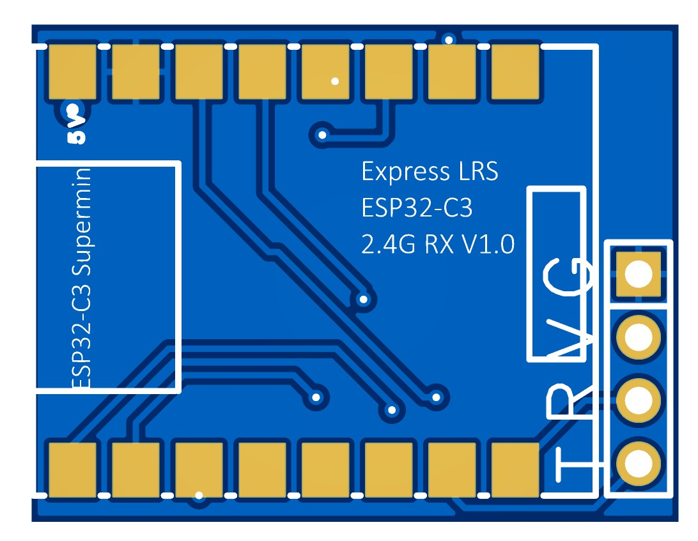
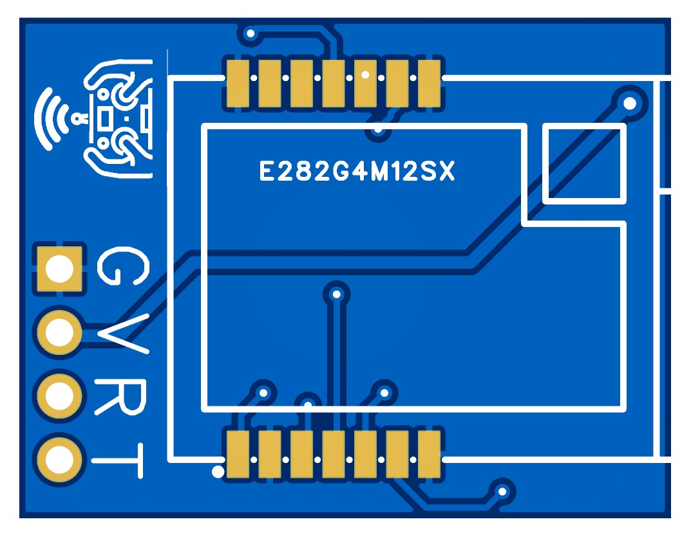
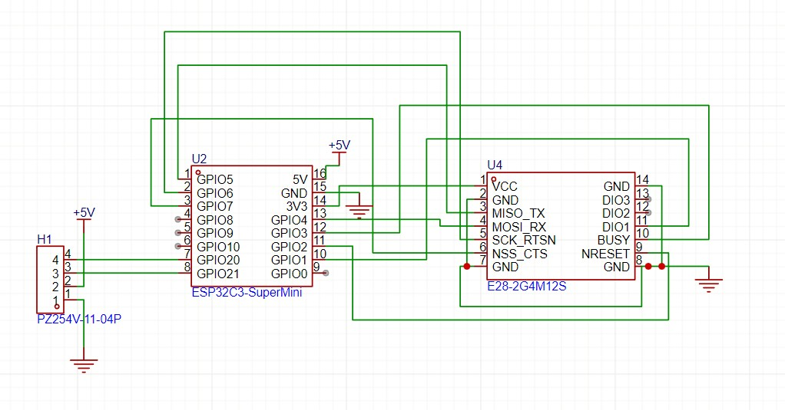

# Solder Friendly 2.4GHz ESP32-C3 ExpressLRS Receiver

## 🚀 The Easiest DIY ExpressLRS Receiver in the World

This project is **super easy to make** and **ultra low cost**.  
You only need **two modules** — no SMD soldering, no extra components
No FTDI needed, use type-C integrated:

- 🧠 **ESP32-C3 SuperMini**
- 📡 **E28 2.4GHz LoRa Module (SX1280)**

Just solder these two modules on a PCB, flash the firmware, and you have a working ExpressLRS 2.4GHz receiver!

---

## Features

* 20x30 footprint
* No SMD components (for easy soldering)
* Components are placed for ease of soldering (easy iron access)
* Use ESP32-C3 Supermini developerment board (LDO, LED already solded)
* 2.4G LORA Module E28

### Wiring Diagram

You can hand made use this wiring diagram, or use PCB below

## Editing

* The PCB has been developed in EasyEDA.

### Schematic

## Ordering

* I've had good results using JLCPCB.

## Build

* Build should be self-explanatory soleing ESP32 and E28 in different side of the PCB.

## BOM

* ESP32-C3 Super Mini
* Ebyte E282G4M12S Module

## Flashing

Plug in usb cable to computer, use web-flasher, choose BAYCKRC 2.4G ESP32-C3 RX

